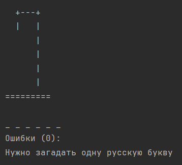
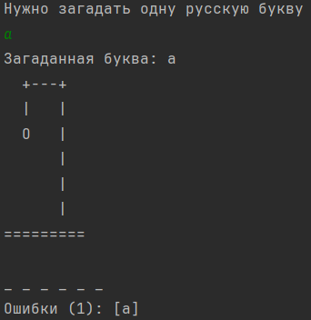
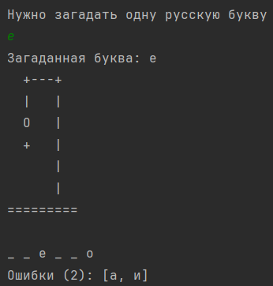
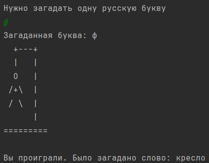
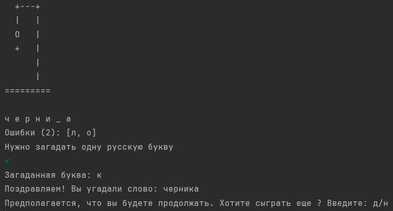

# Виселица (Hangman)

Базовая постановка игры взята отсюда:  
https://ru.wikipedia.org/wiki/Виселица_(игра)

---

## Приветствие

Добро пожаловать в консольную игру **«Виселица»** на Java.

---

## Задача

Компьютер загадывает одно слово — **имя существительное на русском языке в именительном падеже**.  
Игрок должен по буквам угадать это слово.

---

## Правила

- Вводится **одна русская буква** за попытку.
- Валидными считаются **только кириллические буквы в нижнем регистре**.
- Если буква есть в слове — **она открывается во всех соответствующих позициях**.
- Если буквы нет — **игрок получает одну ошибку**.
- **Максимум — 6 ошибок**. На седьмой — игра считается проигранной.
- **Повторный ввод уже названной буквы** не считается ошибкой.

---

## Цель

**Угадать всё слово** до того, как лимит ошибок будет исчерпан.
   

## Скриншоты

### Начало игры

### Ошибки

### Угадывание буквы/букв

### Проигрыш

### Победа 

   

## Запуск и комментарии.

### Требования:
- JDK 17+
- Maven 3+

### Как запустить
- Скачать проект с репозитория
- Запускать метод main из класса Game

### Примечания:
- Словарь расположен в src/main/resources/dictionary.txt
- Проект выполнен в процедурном стиле
- Есть покрытие тестами и необходимые проверки

